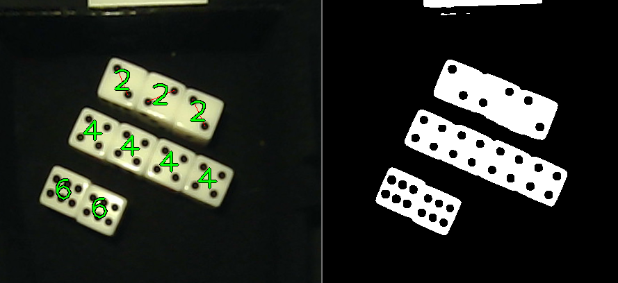

# RealtimeDiceCounter
 Counting dice rolls using successive clustering heuristics

 

## How to run:
 - Tested on Python 3.7.9, numpy 1.19.5, scikit-learn 1.0.2, opencv 4.1.1
 - python count_dice_image.py

## Notes:

  It's assumed that the images are all top-down with even lighting. The script has a bunch of image operations commented out to make the detection in your application easier, including cropping, scaling, compensating for lens distortion, exposure, etc.

 When I started this project the dice counting examples I found used detected edges in order to segment the dice, however this fails when the dice are touching. Instead, this repo clusters detected pips together and uses a series of heursitics to determine dice values, masking out counted pips for each subsequent pass. The first pass clusters pips the tightest (i.e. 3s which could also be 6s), and each subsequent pass clusters pips in looser clusters. For example, the algorithm first searches for all groups of 3 pips (the closest spaced pips on a generic die) then checks if any sets of 3 are close enough together to be 6's. After 6's and 3's are masked out, the algorithm continues to clusters of >= 5 pips, etc. The clustering threshold for 5s is enough to detect all 5s without heuristics. However, 4s need an extra heuristic that locates all intersecting pairs of pips of correct length. As we continually loosen clustering and mask out identified dice, we can rule out all the combinations, leaving any remaining lone pips as most likely rolled 1's.

 Example of detecting 4s with a debugging view showing detecting pips in blue cricles, creating red line segments for each pip pair, and circling in red the pips forming intersecting line segments.
 

 Example showing correct detection of pips even when dice touching. Note the red line segment for 2s looking for the correct distance. 
 

 Example of a known failure for this successive clustering algorithm. Because 4s are searched before 2s, the distance heuristic that filters 2s doesn't trigger.
 